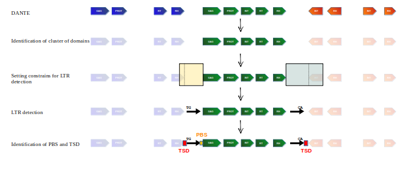

# DANTE_LTR

Tool for identifying complete LTR retrotransposons based on analysis of protein domains identified with the [DANTE tool](https://github.com/kavonrtep/dante). Both DANTE and DANTE_LTR are available on [Galaxy server](ttps://repeatexplorer-elixir.cerit-sc.cz/).

## Principle of DANTE _LTR
Complete retrotransposons are identified as clusters of protein domains recognized by the DANTE tool. The domains in the clusters must be assigned to a single retrotransposon lineage by DANTE. In addition, the orientation and order of the protein domains, as well as the distances between them, must conform to the characteristics of elements from REXXdb database [Neumann et al. (2019)](https://mobilednajournal.biomedcentral.com/articles/10.1186/s13100-018-0144-1). 
In the next step, the 5' and 3' regions of the putative retrotransposon  are examined for the presence of 5' and 3' long terminal repeats. If 5'- and 3'-long terminal repeats are detected, detection of target site duplication (TSD) and primer binding site (PSB) is performed. The detected LTR retrotranspsons are classified into 5 categories:
- Elements with protein domains, 5'LTR, 3'LTR, TSD and PBS - rank **DLTP**.
- Elements with protein domains, 5'LTR, 3'LTR, and PBS (TSD was not found) Rank **DLP**
- Elements with protein domains, 5' LTR, 3'LTR, TSD (PBS was not found) - rank **DTL**
- Elements with protein domains, 5'LTR and 3'LTR (PBS and TDS were not found) - rank **DL**
- Elements as clusters of protein domains with the same classification, no LTRs - rank **D**.




## Installation:
[](https://anaconda.org/petrnovak/dante)

```shell
conda create -n dante_ltr -c bioconda -c conda-forge -c petrnovak dante_ltr
```

[](https://gitpod.io/#https://github.com/kavonrtep/dante_ltr)

## Input data
One input is a reference sequence in fasta fromat. The second input is an annotation of the reference genome using the tool DANTE in GFF3 format. For better results, use the unfiltered full output of the DANTE pipeline.


## Usage

### Detection of complete LTR retrotransposons

```shell
Usage: ./detect_putative_ltr.R COMMAND [OPTIONS]


Options:
        -g GFF3, --gff3=GFF3
                gff3 with dante results

        -s REFERENCE_SEQUENCE, --reference_sequence=REFERENCE_SEQUENCE
                reference sequence as fasta

        -o OUTPUT, --output=OUTPUT
                output file path and prefix

        -c NUMBER, --cpu=NUMBER
                Number of cpu to use [default 5]

        -M NUMBER, --max_missing_domains=NUMBER
                Maximum number of missing domains is retrotransposon [default 0]

        -L NUMBER, --min_relative_length=NUMBER
                Minimum relative length of protein domain to be considered for retrostransposon detection [default 0.6]
        -h, --help
                Show this help message and exit

```

#### Example:

```shell
mkdir -p tmp
./detect_putative_ltr.R -g test_data/sample_DANTE.gff3 -s test_data/sample_genome.fasta -o tmp/ltr_annotation
```

####  Files in the output of `extract_putative_ltr.R`:

- `prefix.gff3` - annotation of all identified elements
- `prefix_D.fasta` - partial elements with protein **d**omains
- `prefix_DL.fasta` - elements with protein **d**omains and **L**TR
- `prefix_DLTP.fasta` - elements with **d**omains, **L**TR, **T**SD and **P**BS
- `prefix_DLP.fasta` - elements with **d**omains, **L**TR and **P**BS
- `prefix_DLT.fasta` - elements with **d**omains, **L**TR, **T**SD 
- `prefix_statistics.csv` - number of elements in individual categories  

For large genomes, you can your `detect_putative_ltr_wrapper.py`. This script will split input fasta to smaller chunks and run `detect_putative_ltr.R` on each chunk to limit memory usage. Output will be merged after all chunks are processed.

```shell
usage: detect_putative_ltr_wrapper.py [-h] -g GFF3 -s REFERENCE_SEQUENCE -o
                                      OUTPUT [-c CPU] [-M MAX_MISSING_DOMAINS]
                                      [-L MIN_RELATIVE_LENGTH]
                                      [-S MAX_CHUNK_SIZE]

detect_putative_ltr_wrapper.py is a wrapper for 
    detect_putative_ltr.R

optional arguments:
  -h, --help            show this help message and exit
  -g GFF3, --gff3 GFF3  gff3 file
  -s REFERENCE_SEQUENCE, --reference_sequence REFERENCE_SEQUENCE
                        reference sequence as fasta file
  -o OUTPUT, --output OUTPUT
                        output file path and prefix
  -c CPU, --cpu CPU     number of CPUs
  -M MAX_MISSING_DOMAINS, --max_missing_domains MAX_MISSING_DOMAINS
  -L MIN_RELATIVE_LENGTH, --min_relative_length MIN_RELATIVE_LENGTH
                        Minimum relative length of protein domain to be considered
                        for retrostransposon detection
  -S MAX_CHUNK_SIZE, --max_chunk_size MAX_CHUNK_SIZE
                        If size of reference sequence is greater than this value,
                         reference is analyzed in chunks of this size. This is
                          just approximate value - sequences which are longer 
                          are are not split, default is 100000000
```

### Validation of LTR retrotransposons detected un previous step:

```shell
./clean_ltr.R --help
Usage: ./clean_ltr.R COMMAND [OPTIONS]


Options:
        -g GFF3, --gff3=GFF3
                gff3  with LTR Transposable elements

        -s REFERENCE_SEQUENCE, --reference_sequence=REFERENCE_SEQUENCE
                reference sequence as fasta

        -o OUTPUT, --output=OUTPUT
                output file prefix

        -c NUMBER, --cpu=NUMBER
                Number of cpu to use [default 5]

        -h, --help
                Show this help message and exit
```

This script check for potentially chimeric elements and removes them from GFF3 file.

#### Example
```shell
./clean_ltr.R -g test_data/sample_DANTE_LTR_annotation.gff3 -s test_data/sample_genome.fasta -o tmp/ltr_annotation_clean
```

