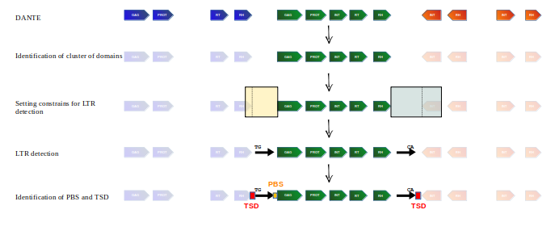

# DANTE_LTR
  - [Citation](#citation)
  - [Principle of DANTE_LTR](#principle-of-dante_ltr)
  - [Availability](#availability)
  - [Installation](#installation)
  - [Quick start guide - How to use DANTE and DANTE_LTR on Galaxy server](#quick-start-guide---how-to-use-dante-and-dante_ltr-on-galaxy-server)
  - [Quick start guide - How to use command line version of DANTE and DANTE_LTR](#quick-start-guide---how-to-use-command-line-version-of-dante-and-dante_ltr)
  - [Boundary refinement](#boundary-refinement)
  - [Solo LTR detection](#solo-ltr-detection)
  - [Modifying LTR-RT search constraints](#modifying-ltr-rt-search-constraints)
  - [Fallback classification mode](#fallback-classification-mode)
  - [CLI reference](#cli-reference)
  - [GFF3 DANTE_LTR output specification](#gff3-dante_ltr-output-specification)


[](https://anaconda.org/petrnovak/dante_ltr)  [](https://zenodo.org/badge/latestdoi/439021837)

Tool for identifying complete LTR retrotransposons based on analysis of protein domains identified with the [DANTE tool](https://github.com/kavonrtep/dante). Both DANTE and DANTE_LTR are available on [Galaxy server](https://repeatexplorer-elixir.cerit-sc.cz/).

## Citation
Novak, P., Hostakova, N., Neumann, P., Macas, J. (2024) – DANTE and DANTE_LTR: lineage-centric annotation pipelines for long terminal repeat retrotransposons in plant genomes. NAR Genomics and Bioinformatics 6:113. [https://doi.org/10.1093/nargab/lqae113]

## Principle of DANTE_LTR
Complete retrotransposons are identified as clusters of protein domains recognized by the DANTE tool. The domains in the clusters must be assigned to a single retrotransposon lineage by DANTE. In addition, the orientation and order of the protein domains, as well as the distances between them, must conform to the characteristics of elements from REXdb database [Neumann et al. (2019)](https://mobilednajournal.biomedcentral.com/articles/10.1186/s13100-018-0144-1). 
In the next step, the 5' and 3' regions of the putative retrotransposon  are examined for the presence of 5' and 3' long terminal repeats. If 5'- and 3'-long terminal repeats are detected, detection of target site duplication (TSD) and primer binding site (PBS) is performed. The detected LTR retrotransposons are classified into 5 categories:
- Elements with protein domains, 5'LTR, 3'LTR, TSD and PBS - rank **DLTP**.
- Elements with protein domains, 5'LTR, 3'LTR, and PBS (TSD was not found) Rank **DLP**.
- Elements with protein domains, 5' LTR, 3'LTR, TSD (PBS was not found) - rank **DLT**.
- Elements with protein domains, 5'LTR and 3'LTR (PBS and TDS were not found) - rank **DL**.
- Elements as clusters of protein domains with the same classification, no LTRs - rank **D**.



## Availability
DANTE_LTR and DANTE are available on [Galaxy server](https://repeatexplorer-elixir.cerit-sc.cz/) or can be installed using conda package manager.


## Installation:
[](https://anaconda.org/petrnovak/dante_ltr)

```shell
conda create -n dante_ltr -c bioconda -c conda-forge -c petrnovak dante_ltr
```
**Important version information** DANTE_LTR versions up to 0.3.5.3 are compatible with REXdb Viridiplante database version 3.0. Versions >=4.0.1 are compatible with REXdb Viridiplante database version 3.0 and 4.0. REXdb Viridiplantae v 4.0 include additional LTR-RT lineages characterized non-angiosperm species. Updated REXdb and used classification system can be found https://github.com/repeatexplorer/rexdb.  
 

[](https://gitpod.io/#https://github.com/kavonrtep/dante_ltr)

## Quick start guide - How to use DANTE and DANTE_LTR on Galaxy server
Detailed tutorial on how to use DANTE and DANTE_LTR on Galaxy server is [here](https://github.com/kavonrtep/protocols/blob/main/genome_annotation_galaxy.md).


## Quick start guide - How to use command line version of DANTE and DANTE_LTR

#### Installation of both DANTE and DANTE_LTR using conda into single environment:
```shell
conda create -n dante_ltr -c bioconda -c conda-forge -c petrnovak dante_ltr=0.4.0.13 dante=0.2.10
conda activate dante_ltr
```
#### Download example data:

```shell
wget https://raw.githubusercontent.com/kavonrtep/dante_ltr/main/test_data/sample_genome.fasta
```

##### Run DANTE on sample genome using 10 cpus:
```shell
dante -q sample_genome.fasta -o DANTE_output.gff3 -c 10
```
Output will contain annotation of individual protein domains identified by DANTE stored in GFF3 file named `DANTE_output.gff3`. Check DANTE documentation for more details (https://github.com/kavonrtep/dante)  

#### Identify complete LTR retrotransposons  from DANTE output using DANTE_LTR
```shell
dante_ltr -g DANTE_output.gff3 -s sample_genome.fasta -o DANTE_LTR_annotation -M 1
```
Option `-M 1` will allow one missing domain in the complete LTR retrotransposon. 

Output files will include: 
- `DANTE_LTR_annotation.gff3` - Annotation of all identified elements
- `DANTE_LTR_annotation_statistics.csv` - number of elements in individual categories
- `DANTE_LTR_annotation_summary.html` - graphical summary of the results

#### Create library of LTR RTs for similarity based annotation
```shell
dante_ltr_to_library -g DANTE_LTR_annotation.gff3 -s sample_genome.fasta -o ltr_library
```
This step will create a non-redundant library of LTR-RT sequences suitable for similarity-based annotation using RepeatMasker. The `-o` argument is an output **directory**. The RepeatMasker-formatted library is written to `ltr_library/mmseqs2/mmseqs_representative_seq_clean_rm_compatible.fasta`; other files in the directory are intermediate artifacts.

#### Outputs you'll actually use

| File | What it is |
|---|---|
| `DANTE_LTR_annotation.gff3` | Annotation of all identified LTR-RT elements |
| `DANTE_LTR_annotation_summary.html` | Graphical summary report |
| `DANTE_LTR_annotation_DLTP.fasta` | Complete elements (highest-confidence rank) |
| `ltr_library/mmseqs2/mmseqs_representative_seq_clean_rm_compatible.fasta` | RepeatMasker-formatted library |

For optional refinement of LTR boundaries, solo-LTR detection, custom
constraints, and fallback classification, see the sections below. The
full per-tool CLI reference is at the end of the document.

## Boundary refinement

`dante_ltr_refine` revisits the LTR outer boundaries of a DANTE_LTR
annotation using cross-element evidence (MMseqs2 clustering of related
elements + parasail anchored extension, with MAFFT change-point fallback)
and emits per-side confidence labels. See
[`docs/refine_v2_analysis.md`](./docs/refine_v2_analysis.md) for the
algorithm, validation data, and term definitions.

### Output labels

Two attributes describe each LTR boundary in the refined GFF3.

**`Refinement_Status`** — outcome of the analysis:

| status | description |
|---|---|
| `not_evaluated` | the element's family was too small for cross-element analysis; the original boundary is retained. |
| `unresolved`    | the analysis was applied but no method produced a validated coordinate; the original boundary is retained. |
| `confirmed`     | the analysis validated the original DANTE_LTR boundary at the same coordinate (two independent signals support the position). |
| `refined`       | the analysis moved the boundary to a new coordinate. |

**`Refinement_Confidence`** — the evidence supporting the call:

| confidence | description |
|---|---|
| `dual`       | the same-role and direct-repeat estimates agree within 5 bp; both validate TG/CA. |
| `divergent`  | both estimates validate TG/CA but disagree by more than 5 bp. |
| `inner_only` | only the direct-repeat estimate validated TG/CA. |
| `mafft`      | the MAFFT change-point detector validated TG/CA. |
| `unrefined`  | no method validated; the original boundary is retained. |

The refined GFF3 also carries diagnostic attributes that are not required
for downstream filtering: `Refinement_Method` (which signal produced the
call), `Original_Start` / `Original_End` (DANTE_LTR's original coordinates,
present only when refinement moved the boundary), and `Cluster_ID` /
`Cluster_Size` (the MMseqs2 cluster the element was analysed in).

### Downstream use

Elements with `Refinement_Status ∈ {confirmed, refined}` constitute the
recommended high-confidence subset. `dante_ltr_to_library --refined_gff3`
and `dante_ltr_solo --refined_gff3` apply this filter by default. Per-side
`target_site_duplication` child features and the TE `TSD=` attribute are
recomputed at the refined coordinates.

### Example

```bash
dante_ltr_refine -g DANTE_LTR_annotation.gff3 \
                 -s sample_genome.fasta \
                 -o refined/sample --threads 4 --workers 4

dante_ltr_solo -g DANTE_LTR_annotation.gff3 \
               --refined_gff3 refined/sample_refined.gff3 \
               -s sample_genome.fasta \
               -o solo_output -c 10
```

For the full CLI option list, see `dante_ltr_refine --help` or
[CLI reference](#cli-reference) below.

## Solo LTR detection

> ⚠️ **Work in progress.** Solo LTR detection is under active
> development; outputs and attribute names may still change between
> releases.

`dante_ltr_solo` identifies solo LTR retrotransposons (LTR/LTR recombination
remnants that have lost their internal region) outside of the elements
already annotated by `dante_ltr`. The tool reuses the complete-element
annotation to build a per-lineage LTR reference library, BLASTs it against
the genome, and validates each candidate with target site duplication (TSD)
and junction checks. Algorithm details are in
[`docs/soloLTR.md`](./docs/soloLTR.md).

The pipeline consumes a refined GFF3 (output of `dante_ltr_refine`) so
that library members can be grouped by per-lineage clusters and ordered
by refinement confidence.  If you pass a plain DANTE_LTR GFF3,
`dante_ltr_solo` runs `dante_ltr_refine` internally and writes the
refined output to `<output_dir>/refined/`.

#### Example

```bash
dante_ltr_solo -g DANTE_LTR_annotation.gff3 \
               -s sample_genome.fasta \
               -o solo_output -c 10
```

For the full CLI option list, see `dante_ltr_solo --help` or
[CLI reference](#cli-reference) below.

#### Output files

- `solo_ltr.gff3` — one representative per locus, **excluding** entries
  that look like fragments of unannotated complete elements (see below).
  This is the file to use for downstream analysis.
- `solo_ltr_te_fragments.gff3` — `SL_noTSD` representatives with a
  positive `UTR5_junction`, `PPT_junction`, or `PBS_check` signal.
  These are unlikely to be solo LTRs; they typically point to regions
  where the upstream `dante_ltr` annotation missed a complete element.
- `solo_ltr_raw.gff3` — every BLAST hit (deduped by exact coordinates).
  Useful for QC / inspecting fragmentation.
- `solo_ltr_statistics.csv` — per-lineage counts of SL, SL_noTSD,
  complete elements, and the `Rsf` ratio (solo / complete), computed on
  the representative file (TE fragments excluded).
- `solo_ltr_te_fragments_statistics.csv` — per-lineage TE-fragment
  counts.
- `solo_ltr_raw_statistics.csv` — the same counts computed on the raw
  file (inflated by duplicates, kept for comparison).
- `library/` — the LTR library built from the input annotation, including
  the MAFFT per-cluster alignments and a per-cluster
  `*_LTR_library_boundary_qc.tsv` QC table.
- `refined/` — the refined GFF3 used as input (either the supplied
  refined GFF3 or the one produced by the auto-run of `dante_ltr_refine`).
- `chunks/` — per-chunk intermediate outputs and raw BLAST tabular files.

#### Additional `solo_LTR` attributes

- `Rank` — `SL` (TSD confirmed) or `SL_noTSD`.
- `TSD` — the TSD sequence (exact) or `SEQ1/SEQ2` for 1-mismatch, or
  `not_found`.
- `LibraryID` — the library consensus id (`LTR_XXXXXX`) that produced the
  hit.
- `LibraryConfidence` — provenance of the library entry that produced
  this hit, one of `validated` (built from refinement-validated members
  only), `mixed` (cluster was evaluated but no member reached
  validated; built from `unresolved` members), or `unrefined` (cluster
  was too small for refinement; built via change-point fallback on the
  raw annotated boundaries).
- `ClusterSize` — number of raw hits collapsed into this representative.
- `SupportingHits` — comma-separated `LibraryID`s of the other raw hits
  in the cluster (omitted when `ClusterSize == 1`).
- `boundary_uncertain=true` — the SL representative is strictly contained
  (≥ 80 % of its length) inside a longer SL_noTSD member of the same
  cluster, indicating the representative's boundaries may be too tight.
- `class_conflict=true` — at least one reciprocal-overlap pair in the
  cluster had different `Final_Classification`.
- `UTR5_junction`, `PPT_junction`, `PBS_check` — for `SL_noTSD` rows:
  `positive` indicates the hit looks like a fragment of an unannotated
  complete element on that side; `not_applicable` for `SL` rows.  Any
  representative with at least one `positive` is partitioned out of
  `solo_ltr.gff3` and emitted in `solo_ltr_te_fragments.gff3` instead.

## Modifying LTR-RT search constraints

It is possible to modify constraints for LTR search by providing a csv table with constraints for individual lineages.

The table has the following format:

|Lineage	|Domains order	|offset5prime	|offset3prime | 	domain_span	 |  ltr_length |
|-----------|---------------|---------------|-------------|----------------|-------------|
|Class_I/LTR/Ty1_copia/Ale	|GAG PROT INT RT RH|	2000|	2000|	5700|	123|
|Class_I/LTR/Ty1_copia/Alesia	|GAG PROT INT RT RH|	2000|	3000|	5400|	273|
|Class_I/LTR/Ty1_copia/Angela	|GAG PROT INT RT RH|	6000|	3000|	5500|	1074|
|Class_I/LTR/Ty1_copia/Bianca	|GAG PROT INT RT RH|	3500|	3000|	6000|	132|
|Class_I/LTR/Ty1_copia/Bryco	|GAG PROT INT RT RH|	3000|	3000|	5000|	287|
|Class_I/LTR/Ty1_copia/Gymco-I	|GAG PROT INT RT RH|	3500|	2500|	5400|	151|
|Class_I/LTR/Ty1_copia/Gymco-II	|GAG PROT INT RT RH|	2000|	6000|	4600|	156|
|Class_I/LTR/Ty1_copia/Gymco-III	|GAG PROT INT RT RH|	2000|	2000|	5400|	247|
|Class_I/LTR/Ty1_copia/Gymco-IV	|GAG PROT INT RT RH|	2000|	2000|	5400|	276|
|Class_I/LTR/Ty1_copia/Ikeros	|GAG PROT INT RT RH|	6500|	3000|	6100|	359|
|...    |...	|...	|...	|...	|...|

- The `Domain order` column defines the order of individual protein domains required for positive detection of the elements.  

- The number in the `offset5prime`  column is the size of the upstream region used to search for the 5' LTR, while the `offset3prime` is the size of the downstream region used to search for the 3' LTR (These values correspond to yellowish and greenish boxes in the figure above).
- The `domain_span` is the maximal distance between N' end of first domain and the C' end of the last domain of the element.

Modify these constraints if you think that the default constraints lead to under-detection of elements whose structure deviates from the default constraints. Setting `offset5prime`, `offset3prime` or `domain_span`  too high can however lead to the detection of aberrant or chimeric elements. 
- The `ltr_length` is the shortest LTR for given lineage in REXdb database. LTR must be at least 80% of this value. 
To use modified constraints use `dante_ltr` with option `--te_constrains` and provide the path to the modified csv table.

The full table with default constraints can be found in  
[databases/lineage_domain_order.csv](./databases/lineage_domain_order.csv).

## Fallback classification mode

> ⚠️ Experimental (0.4.0.13).

For genomes poorly covered by REXdb, DANTE frequently cannot resolve
LTR protein domains past the superfamily or subfamily level. In that
case `dante_ltr`'s default lineage-keyed matching misses most
elements. `--fallback_mode` demotes all input `Final_Classification`
values to a chosen coarse depth and uses a correspondingly relaxed
constraints table. The pre-demotion value is kept on each feature as
`Original_Classification`.

| mode | classifies into |
|---|---|
| `none` | lineage (default) |
| `coarse3` | `copia`, `gypsy/chromovirus`, `gypsy/non-chromovirus` |
| `coarse2` | `copia`, `gypsy` |

Full spec: [docs/fallback_classification_spec.md](./docs/fallback_classification_spec.md).

## CLI reference

Full option lists for each tool. Also available via `--help`.

### `dante_ltr` — Detection of complete LTR retrotransposons

```
usage: dante_ltr [-h] -g GFF3 -s REFERENCE_SEQUENCE -o OUTPUT [-c CPU]
                 [-M MAX_MISSING_DOMAINS] [-L MIN_RELATIVE_LENGTH] [-S MAX_CHUNK_SIZE]
                 [-v] [--te_constrains TE_CONSTRAINS] [--no_ambiguous_domains]
                 [--fallback_mode {none,coarse3,coarse2}]

options:
  -h, --help            show this help message and exit
  -g GFF3, --gff3 GFF3  gff3 file with full output from Domain Based Annotation of Transposable Elements (DANTE)
  -s REFERENCE_SEQUENCE, --reference_sequence REFERENCE_SEQUENCE
                        reference sequence as fasta file
  -o OUTPUT, --output OUTPUT
                        output file path and prefix
  -c CPU, --cpu CPU     number of CPUs
  -M MAX_MISSING_DOMAINS, --max_missing_domains MAX_MISSING_DOMAINS
  -L MIN_RELATIVE_LENGTH, --min_relative_length MIN_RELATIVE_LENGTH
                        Minimum relative length of protein domain to be considered for retrotransposon detection
  -S MAX_CHUNK_SIZE, --max_chunk_size MAX_CHUNK_SIZE
                        If size of reference sequence is greater than this value,
                        reference is analyzed in chunks of this size (default 100000000).
                        Setting this value too small will slow down the analysis.
  -v, --version         show program's version number and exit
  --te_constrains TE_CONSTRAINS
                        csv table specifying TE constraints for LTR search; template at
                        https://github.com/kavonrtep/dante_ltr/blob/main/databases/lineage_domain_order.csv
  --no_ambiguous_domains
                        Remove ambiguous domains from analysis
  --fallback_mode {none,coarse3,coarse2}
                        Classify at a reduced taxonomic depth and demote DANTE's
                        lineage-level calls accordingly (see "Fallback classification mode").
```

### `dante_ltr_to_library` — Build a non-redundant LTR-RT library

```
usage: dante_ltr_to_library [-h] -g GFF3 -s REFERENCE_SEQUENCE -o OUTPUT_DIR
                            [-m MIN_COVERAGE] [-c CPU]

options:
  -g GFF3                gff3 file
  -s REFERENCE_SEQUENCE  fasta file
  -o OUTPUT_DIR          output directory
  -m MIN_COVERAGE        minimum cluster coverage to include in library (default: 3)
  -c CPU                 number of CPUs
```

### `dante_ltr_refine` — Boundary refinement

```
usage: dante_ltr_refine -g GFF3 -s GENOME -o OUTPUT [OPTIONS]

options:
  -g GFF3                       DANTE_LTR GFF3 input.
  -s GENOME                     Reference genome FASTA.
  -o OUTPUT                     Output prefix (4 files: refined GFF3, per-element TSV,
                                cluster TSV, run JSON).
  --identity 0.9                MMseqs2 cluster identity.
  --min_cluster_size 6          Minimum members per role (5'LTR and 3'LTR
                                must each have >= N).
  --anchor_len 50               Anchor length inside LTR (bp).
  --flank_len 1000              Flank length scanned outside LTR (bp).
  --no_tsd_revert               Disable per-element TSD-loss revert rule (diagnostic).
  --no_msa_rescue               Disable per-side MAFFT MSA rescue;
                                fall back to threshold-gated MAFFT.
  --mafft_fallback_threshold 0.5
                                Inner-pool validation rate below which MAFFT change-point
                                fallback fires (only used with --no_msa_rescue).
  --no-mafft-fallback           Disable MAFFT entirely (parasail-only).
  --threads 4                   MMseqs2 / MAFFT threads.
  --workers 4                   Parallel cluster workers.
```

### `dante_ltr_solo` — Solo LTR detection

```
usage: dante_ltr_solo -g GFF3 -s REFERENCE_SEQUENCE -o OUTPUT_DIR [-c CPU]
                      [-i MIN_IDENTITY] [-C MIN_COVERAGE] [-S MAX_CHUNK_SIZE]

options:
  -g GFF3                  DANTE_LTR annotation GFF3 (from dante_ltr).  May
                           be either an unrefined or a refined GFF3; if
                           unrefined, dante_ltr_refine is run automatically
                           and the result is written to <OUTPUT_DIR>/refined/.
  -s REFERENCE_SEQUENCE    Reference genome FASTA.
  -o OUTPUT_DIR            Output directory.
  -c CPU                   Number of CPUs.
  -i MIN_IDENTITY          Minimum BLAST % identity (default 80).
  -C MIN_COVERAGE          Minimum alignment coverage of library LTR (default 0.8).
  -S MAX_CHUNK_SIZE        Genome chunk size for parallel search (default 100000000).
```

## GFF3 DANTE_LTR output specification

Feature types in the output GFF3:

- **target_site_duplication** — direct repeats around the insertion site.
- **transposable_element** — the full extent of the LTR retrotransposon.
- **long_terminal_repeat** (LTR) — direct repeats at the element's termini.
- **protein_domain** — a polyprotein domain identified by DANTE.
- **primer_binding_site** — site where a tRNA primer binds to initiate
  reverse transcription.

Core attributes you'll typically work with:

- **Rank** — `D`, `DL`, `DLT`, `DLP`, or `DLTP` (see [Principle](#principle-of-dante_ltr)).
- **ID** — unique feature identifier.
- **Final_Classification** — hierarchical REXdb classification.
- **LTR_Identity** — % identity between 5' and 3' LTRs.
- **TSD** — the target site duplication sequence.

For the full attribute list (DANTE protein-domain fields, PBS metadata,
diagnostic fields), see
[`docs/gff3_attributes.md`](./docs/gff3_attributes.md).


